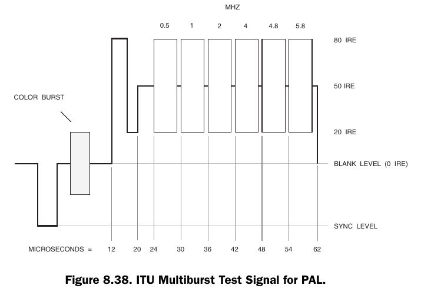

# LaserDisc PAL and NTSC Test Signals — Detailed Timing & Level Analysis

**Reference:**
*Video Demystified, 5th Edition* — ISBN 978-0-750-68395-1

Assumptions unless stated otherwise:

* 75 Ω terminated composite video
* 1 V p-p nominal (PAL), 1 V p-p NTSC (with −40 to −43 IRE sync)
* Timing measured from leading edge of horizontal sync

---

## PAL System Reference (625/50)

| Parameter                | Value                 |
| ------------------------ | --------------------- |
| Line period              | 64.0 µs               |
| Active video             | ≈52 µs                |
| Horizontal sync          | ≈4.7 µs               |
| Front porch              | ≈1.65 µs              |
| Back porch (incl. burst) | ≈5.7 µs               |
| Colour subcarrier        | 4.43361875 MHz        |
| Burst length             | ~10 cycles (≈2.25 µs) |
| Sync level               | −43 IRE (≈−300 mV)    |
| Blank level              | 0 IRE                 |
| Peak white               | +100 IRE (≈700 mV)    |

---

## ITU Composite Test Signal for PAL (Figure 8.41)

**VITS line:** 19

### Description
The ITU (BT.628 and BT.473) has developed a composite test signal that may be used to test several video parameters, rather than using multiple test signals. The ITU composite test signal for PAL systems (shown in Figure 8.41) consists of a white flag, a 2T pulse, and a 5-step modulated staircase signal.

The white flag has a peak amplitude of 100 ±1 IRE and a width of 10 µs.

The 2T pulse has a peak amplitude of 100 ±0.5 IRE, with a half-amplitude width of 200 ±10 ns.

The 5-step modulated staircase signal consists of 5 luminance steps (whose IRE values are shown in Figure 8.41) superimposed with a 42.86 ±0.5 IRE subcarrier that has a phase of 60° ±1° relative to the U axis. The rise and fall times of each modulation packet envelope are approximately 1 µs.

### Timing Breakdown (approx.)

* Sync → burst end: ~12 µs
* 100 IRE flat white: ~12 µs to ~22 µs
* 2T pulse: 
  * centered on 26 µs
  * (bandwidth stress at ~2.2 MHz)
* Staircase section begins: ~30 µs (30 µs, 40 µs, 44 µs, 48 µs, 52 µs, 56 µs, 60 µs)
* End of active content: ~60 µs

### Levels

* Sync: −43 IRE
* Burst centered on blank (±20 IRE chroma amplitude)
* Staircase steps: 0, 20, 40, 60, 80, 100 IRE

---

## United Kingdom PAL National Test Signal #1 (Figure 8.42)

**VITS line:** 332

### Description
U.K. Version

The United Kingdom allows the use of a slightly different test signal since the 10T pulse is more sensitive to delay errors than the 20T pulse (at the expense of occupying less chrominance bandwidth). Selection of an appropriate pulse width is a trade-off between occupying the PAL chrominance bandwidth as fully as possible and obtaining a pulse with sufficient sensitivity to delay errors. Thus, the national test signal (developed by the British Broadcasting Corporation and the Independent Television Authority) in Figure 8.42 may be present on lines 19 and 332 for (I) PAL systems in the United Kingdom.

The white flag has a peak amplitude of 100 ±1 IRE and a width of 10 µs.

The 2T pulse has a peak amplitude of 100 ±0.5 IRE, with a half-amplitude width of 200 ±10 ns.

The 10T chrominance pulse has a peak amplitude of 100 ±0.5 IRE.

The 5-step modulated staircase signal consists of 5 luminance steps (whose IRE values are shown in Figure 8.42) superimposed with a 21.43 ±0.5 IRE subcarrier that has a phase of 60° ±1° relative to the U axis. The rise and fall times of each modulation packet envelope is approximately 1 µs.

### Distinguishing Features

* Replaces the 12.5T pulse (ITU) with a **10T pulse**
* Slightly different staircase geometry

### Timing Notes

* Sync + burst complete by ~12 µs
* 100 IRE reference: ~12–22 µs
* 2T pulse: centered on 26 µs
* 10T pulse: centered 30 µs
* Staircase: ~34–60 µs

---

## ITU Combination ITS Test Signal for PAL (Figure 8.45)

**VITS line:** 20

### Description
ITU ITS Version for PAL

The ITU (BT.473) has developed a combination ITS (insertion test signal) that may be used to test several PAL video parameters, rather than using multiple test signals. The ITU combination ITS for PAL systems (shown in Figure 8.45) consists of a 3-step modulated pedestal with peak-to-peak amplitudes of 20, 60, and 100 ±1 IRE, and an extended subcarrier packet with a peak-to-peak amplitude of 60 ±1 IRE. The rise and fall times of each subcarrier packet envelope are approximately 1 µs.

The phase of each subcarrier packet is 60° ±1° relative to the U axis. The tolerance on the 50 IRE level is ±1 IRE.

The ITU composite ITS may be present on line 331.

### Structure

1. Sync + burst
2. Multi-level luminance steps (40-60, 20-80, 0-100 IRE)
3. 20-80 IRE reference block

### Timing Highlights

* Luminance steps occupy ~14–28 µs
* IRE reference block ~34–60 µs

---

## ITU Multiburst Test Signal for PAL (Figure 8.38)

**VITS line:** 333

### Description
The ITU multiburst test signal for (B, D, G, H, I) PAL, shown in Figure 8.38, consists of a 4 µs white flag with a peak amplitude of 80 ±1 IRE and six frequency packets, each a specific frequency. The packets have a 50 ±1 IRE pedestal with peak-to-peak amplitudes of 60 ±0.5 IRE. Note the starting and ending points of each packet are at zero phase. The gaps between packets are 0.4–2.0 µs. The ITU multiburst test signal may be present on line 18.

The multiburst signals are used to test the frequency response of the system by measuring the peak-to-peak amplitudes of the packets.

### Burst Frequencies (luminance multiburst)

| Segment | Frequency |
| ------- | --------- |
| 1       | 0.5 MHz   |
| 2       | 1.0 MHz   |
| 3       | 2.0 MHz   |
| 4       | 4.0 MHz   |
| 5       | 4.8 MHz   |
| 6       | 5.8 MHz   |

### Timing

* 80 IRE reference bank
* Multiburst section: 24 µs, 30 µs, 36 µs, 42 µs, 48 µs, 54
* Level: 20-80 IRE

---

# NTSC System Reference (525/59.94)

| Parameter         | Value          |
| ----------------- | -------------- |
| Line period       | 63.556 µs      |
| Colour subcarrier | 3.579545 MHz   |
| Burst length      | ~9 cycles      |
| Sync level        | −40 to −43 IRE |
| Active video      | ≈52.7 µs       |

---

## Vertical Interval Reference Signal (VIRS)

**VITS lines:** 19 and 282

### Description

In NTSC systems, the Vertical Interval Reference (VIR) signal is a program-related reference inserted in the vertical blanking interval (commonly line 19 in each field in the USA) to help maintain consistent luminance/chroma setup through a broadcast chain.

### Structure

* **Sync tip:** **–40 IRE (peak)**
* **Burst**
* **Blanking level:** **0 IRE**
* **Chrominance reference (superimposed on the 70 IRE pedestal):** **±20 IRE** about the pedestal (i.e., swings from **50 IRE to 90 IRE**, with **90 IRE peak**). 
* **Black reference (“setup”):** **+7.5 IRE**
* **Luminance reference pedestal:** **+70 IRE**

### Timing

The VIR content shown spans **60 µs**, partitioned as:

* **12 µs** (initial segment after sync/back-porch region in the diagram)
* **24 µs** (luminance pedestal with superimposed chrominance reference)
* **12 µs** Luminance reference
* **12 µs** Black reference

---

## NTC-7 Combination Test Signal for NTSC (Figure 8.43)

**VITS line:**  20

### Description
NTC-7 Version for NTSC

The NTC (U. S. Network Transmission Committee) has also developed a combination test signal that may be used to test several video parameters, rather than using multiple test signals. The NTC-7 combination test signal for NTSC systems (shown in Figure 8.43) consists of a white flag, a multiburst, and a modulated pedestal signal.

The white flag has a peak amplitude of 100 ±1 IRE and a width of 4 µs.

The multiburst has a 50 ±1 IRE pedestal with peak-to-peak amplitudes of 50 ±0.5 IRE. The starting point of each frequency packet is at zero phase. The width of the 0.5 MHz packet is 5 µs; the width of the remaining packets is 3 µs.

The 3-step modulated pedestal is composed of a 50 IRE luminance pedestal, superimposed with three amplitudes of modulated chrominance (20 ±0.5, 40 ±0.5, and 80 ±0.5 IRE peak-to-peak) that have a phase of –90° ±1° relative to the burst. The rise and fall times of each modulation packet envelope are 400 ±25 ns.

The NTC-7 combination test signal may be present on line 280.

### Components

* Multiburst: 0.5–4.2 MHz
* 100 IRE white reference
* Luminance pedestal block (~50 IRE)

### Timing

* Multiburst: ~18–40 µs
* Pedestal block: ~46–60 µs

---

## NTC-7 Composite Test Signal for NTSC (Figure 8.40)

**VITS line:**  283

### Description
NTC-7 Version for NTSC

The NTC (U. S. Network Transmission Committee) has developed a composite test signal that may be used to test several video parameters, rather than using multiple test signals. The NTC-7 composite test signal for NTSC systems (shown in Figure 8.40) consists of a 100 IRE line bar, a 2T pulse, a 12.5T chrominance pulse, and a 5-step modulated staircase signal.

The line bar has a peak amplitude of 100 ±0.5 IRE, and 10–90% rise and fall times of 125 ±5 ns with an integrated sine-squared shape. It has a width at the 60 IRE level of 18 µs.

The 2T pulse has a peak amplitude of 100 ±0.5 IRE, with a half-amplitude width of 250 ±10 ns.

The 12.5T chrominance pulse has a peak amplitude of 100 ±0.5 IRE, with a half-amplitude width of 1562.5 ±50 ns.

The 5-step modulated staircase signal consists of 5 luminance steps superimposed with a 40 ±0.5 IRE subcarrier that has a phase of 0° ±1° relative to the burst. The rise and fall times of each modulation packet envelope are 400 ±25 ns.

The NTC-7 composite test signal may be present on line 17.

### Elements

* 100 IRE white bar
* 2T and 12.5T pulses
* Staircase (0–90 IRE)
