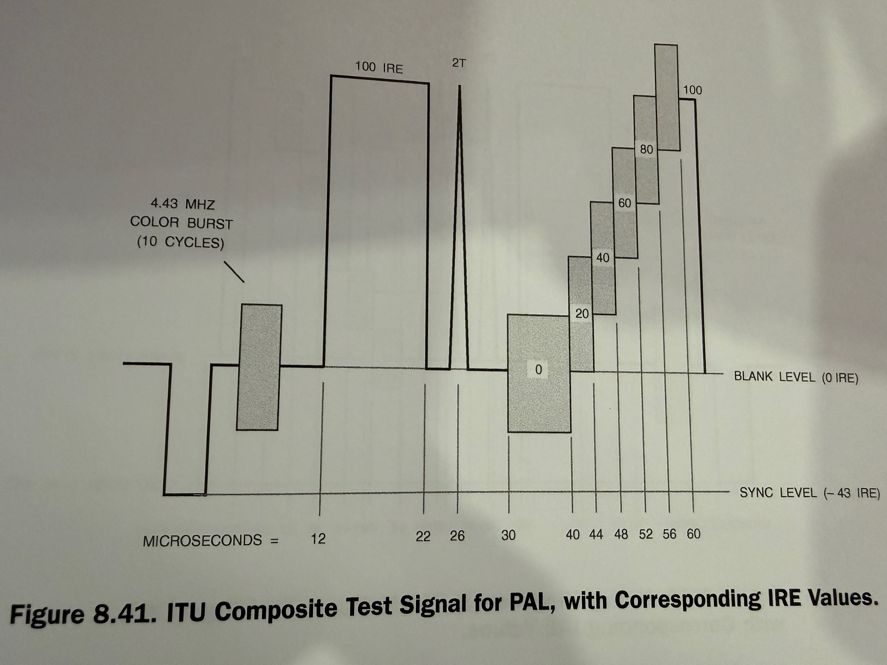
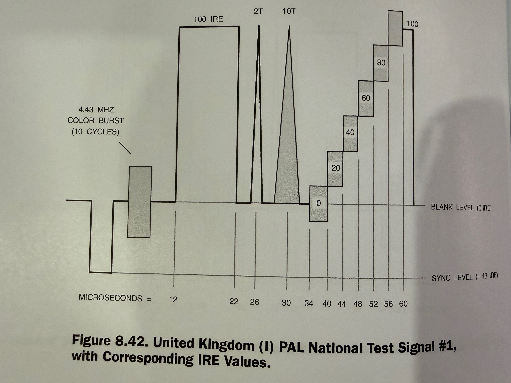
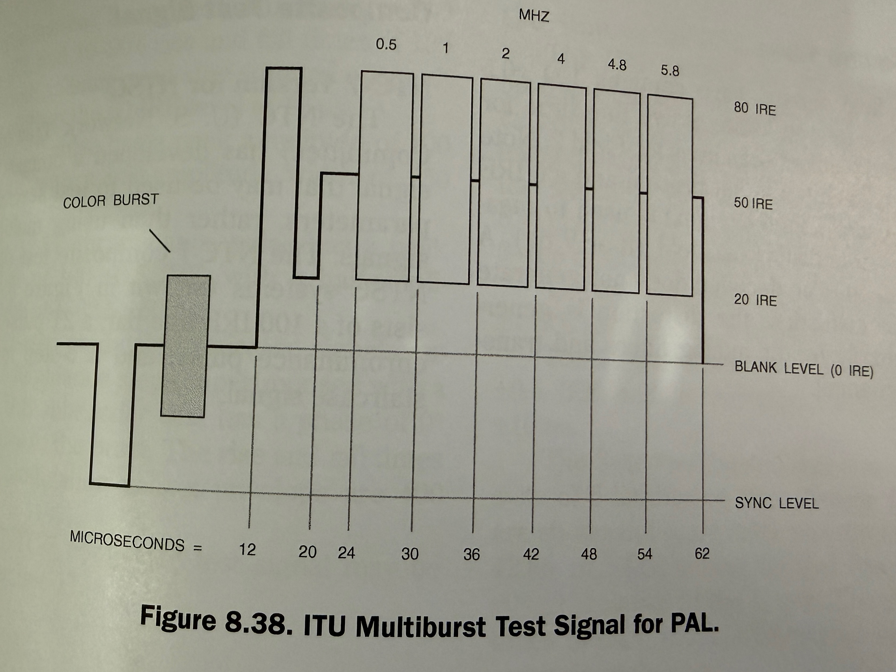
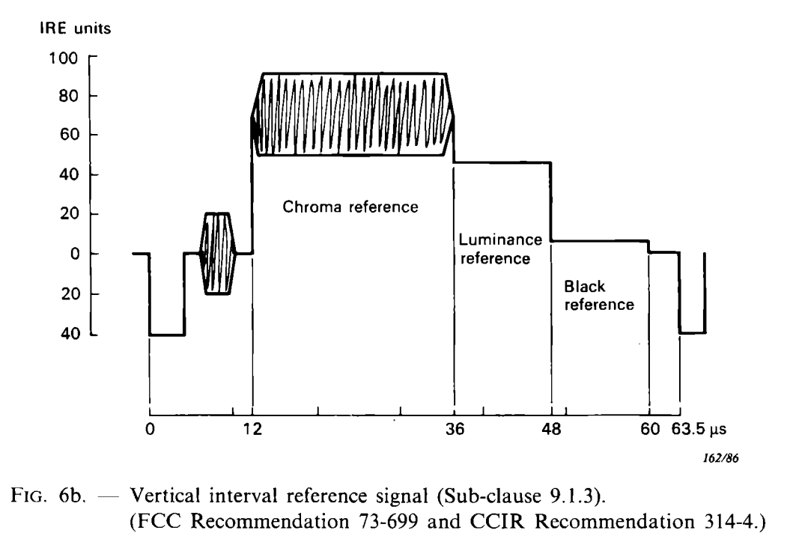
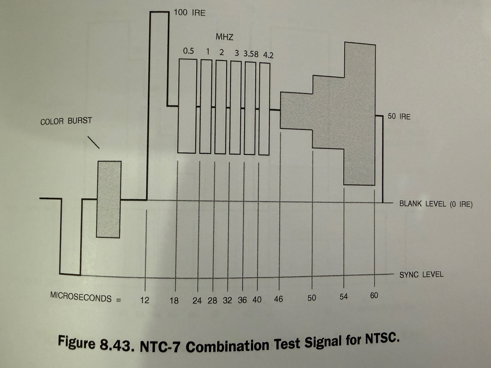
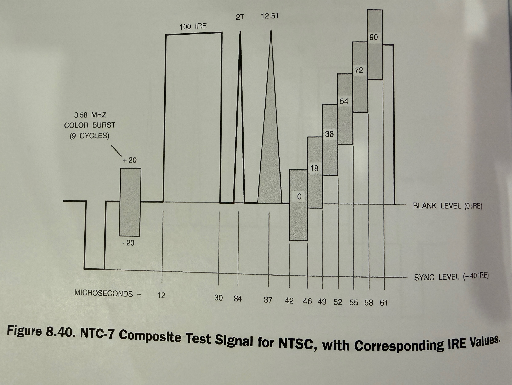

# LaserDisc PAL and NTSC Test Signals — Detailed Timing & Level Analysis

**Reference:**
*Video Demystified, 5th Edition* — ISBN 978-0-750-68395-1

Assumptions unless stated otherwise:

* 75 Ω terminated composite video
* 1 V p-p nominal (PAL), 1 V p-p NTSC (with −40 to −43 IRE sync)
* Timing measured from leading edge of horizontal sync

---

## PAL System Reference (625/50)

| Parameter                | Value                 |
| ------------------------ | --------------------- |
| Line period              | 64.0 µs               |
| Active video             | ≈52 µs                |
| Horizontal sync          | ≈4.7 µs               |
| Front porch              | ≈1.65 µs              |
| Back porch (incl. burst) | ≈5.7 µs               |
| Colour subcarrier        | 4.43361875 MHz        |
| Burst length             | ~10 cycles (≈2.25 µs) |
| Sync level               | −43 IRE (≈−300 mV)    |
| Blank level              | 0 IRE                 |
| Peak white               | +100 IRE (≈700 mV)    |

---

## ITU Composite Test Signal for PAL (Figure 8.41)

**VITS line:** 19

### Timing Breakdown (approx.)

* Sync → burst end: ~12 µs
* 100 IRE flat white: ~12 µs to ~22 µs
* 2T pulse: 
  * centered on 26 µs
  * (≈0.45 µs wide → bandwidth stress at ~2.2 MHz) CHECK THIS
* Staircase section begins: ~30 µs (30,40,44,48.52,56,60)
* End of active content: ~60 µs

### Levels

* Sync: −43 IRE
* Burst centered on blank (±20 IRE chroma amplitude)
* Staircase steps: 0, 20, 40, 60, 80, 100 IRE

### Purpose

* Verifies **luminance linearity**
* Confirms **sync tip and blank alignment**
* Tests **transient response** via 2T pulse
* Checks **burst amplitude and phase stability**

---

## United Kingdom PAL National Test Signal #1 (Figure 8.42)

**VITS line:** 332

### Distinguishing Features

* Replaces the 12.5T pulse (ITU) with a **10T pulse**
* Slightly different staircase geometry

### Timing Notes

* Sync + burst complete by ~12 µs
* 100 IRE reference: ~12–22 µs
* 2T pulse: ~24–26 µs
* 10T pulse: ~26–34 µs
* Staircase: ~34–60 µs

### Engineering Use

* UK broadcast compliance testing
* Separates **high-frequency ringing** (2T) from **mid-band response** (10T)
* Useful for evaluating **PAL decoder chroma/luma separation**

---

## ITU Combination ITS Test Signal for PAL (Figure 8.45)

**VITS line:** 20

### Structure

1. Sync + burst
2. Multi-level luminance steps (20–100 IRE)
3. 100 IRE reference block
4. 2T pulse
5. Wide luminance block (~80 IRE)

### Timing Highlights

* Luminance steps occupy ~12–28 µs
* 2T pulse centered ~28–30 µs
* Wide luminance block ~34–60 µs

### Purpose

* Simultaneous test of:

  * **Low-frequency gain**
  * **Transient response**
  * **DC restoration**
  * **White clipping**

---

## ITU Multiburst Test Signal for PAL (Figure 8.38)

**VITS line:** 333

### Burst Frequencies (luminance multiburst)

| Segment | Frequency |
| ------- | --------- |
| 1       | 0.5 MHz   |
| 2       | 1.0 MHz   |
| 3       | 2.0 MHz   |
| 4       | 4.0 MHz   |
| 5       | 4.8 MHz   |
| 6       | 5.8 MHz   |

### Timing

* Multiburst section: ~20–54 µs
* Each burst ≈5–6 µs long
* Level: ~80 IRE peak-to-peak

### Engineering Interpretation

* Amplitude roll-off indicates **luminance bandwidth**
* Phase distortion shows as burst asymmetry
* > 5 MHz bursts test **LaserDisc player RF and deemphasis**

---

# NTSC System Reference (525/59.94)

| Parameter         | Value          |
| ----------------- | -------------- |
| Line period       | 63.556 µs      |
| Colour subcarrier | 3.579545 MHz   |
| Burst length      | ~9 cycles      |
| Sync level        | −40 to −43 IRE |
| Active video      | ≈52.7 µs       |

---

## Vertical Interval Reference Signal (VIRS)

**VITS lines:** 19 and 282

### Structure

1. Sync + burst
2. Chroma reference block (~70–80 IRE with subcarrier)
3. Luminance reference (~50 IRE)
4. Black reference (0 IRE)

### Timing

* Chroma reference: ~12–36 µs
* Luminance reference: ~36–48 µs
* Black reference: ~48–60 µs

### Use

* Absolute **system calibration**
* Decoder **AGC reference**
* Chroma gain and phase check

---

## NTC-7 Combination Test Signal for NTSC (Figure 8.43)

**VITS line:**  20

### Components

* Multiburst: 0.5–4.2 MHz
* 100 IRE white reference
* Luminance pedestal block (~50 IRE)

### Timing

* Multiburst: ~18–40 µs
* Pedestal block: ~46–60 µs

### Use

* Bandwidth and frequency response
* Luminance non-linearity detection

---

## NTC-7 Composite Test Signal for NTSC (Figure 8.40)

**VITS line:**  283
### Elements

* 100 IRE white bar
* 2T and 12.5T pulses
* Staircase (0–90 IRE)

### Purpose

* Full-chain NTSC composite validation
* Pulse response reveals **group delay**
* Staircase confirms **gamma and gain**

---

## Practical Notes for FPGA / Encoder Work

* **2T pulse width**
  ≈0.45 µs → critical for verifying pixel clock vs line timing
* **10T / 12.5T pulses**
  Reveal mid-band shaping errors (often missed by multiburst alone)
* **Staircase DC accuracy**
  Exposes clamp and black-level drift
* **Multiburst at >5 MHz (PAL)**
  Particularly useful for LaserDisc RF chain validation

---

If you want, the next step can be:

* a **cycle-accurate PAL/NTSC line timeline** suitable for HDL
* or a **table converting each feature into pixel counts** at common sample rates (13.5 MHz, 27 MHz, etc.)
