# Testcard Raw Y'CbCr 4:2:2 Assets

The raw frame collections live in `assets/720x576/stills/raw/` and `assets/720x480/stills/raw/`. They contain single-frame **Y'CbCr 4:2:2** test material sized to the active picture area only.

## Format Specification

| Property | Value |
|---|---|
| Sampling | Y'CbCr 4:2:2 |
| Storage | 10-bit component values packed into 16-bit little-endian words |
| Packing order | Y0, Cb, Y1, Cr for each pixel pair |
| Colour space | ITU-R BT.601-derived component video |
| Luma range | 64 (black) – 940 (peak white); values outside this range are valid sub-black / super-white content |
| Chroma range | 64 – 960; neutral (no colour) at 512 |
| Interlace | Field 1 only (single still frame) |

Each pixel pair occupies **8 bytes** (four 16-bit LE words). File size = width × height × 4 bytes.

## Active Picture Dimensions

| System | Dimensions | File size |
|---|---|---|
| PAL | 720 × 576 | 1,658,880 bytes |
| NTSC | 720 × 480 | 1,382,400 bytes |
| PAL-M | Uses 720 × 480 NTSC-sized assets | 1,382,400 bytes |

## Complete File Inventory

The table below lists every raw file present in both collections. Files named identically across both directories contain the same test pattern adapted to the respective active picture area. The SMPTE bars pattern uses a different variant filename in each collection.

| File (PAL `720x576/stills/raw/`) | File (NTSC `720x480/stills/raw/`) | Description |
|---|---|---|
| `100_BARS.raw` | `100_BARS.raw` | 100% saturated colour bars |
| `75_BARS.raw` | `75_BARS.raw` | EBU 75% colour bars |
| `75_BARS_RED.raw` | `75_BARS_RED.raw` | 75% colour bars with red sub-bars |
| `CHROMA_RAMP.raw` | `CHROMA_RAMP.raw` | Horizontal chroma saturation ramp |
| `FULL_RAMP.raw` | `FULL_RAMP.raw` | Full range luma ramp (sub-black to super-white) |
| `GREY_10H_STEP.raw` | `GREY_10H_STEP.raw` | 10-step horizontal greyscale staircase |
| `GREY_10V_STEP.raw` | `GREY_10V_STEP.raw` | 10-step vertical greyscale staircase |
| `GREY_5H_STEP.raw` | `GREY_5H_STEP.raw` | 5-step horizontal greyscale staircase |
| `GREY_5V_STEP.raw` | `GREY_5V_STEP.raw` | 5-step vertical greyscale staircase |
| `LEGAL_RAMP.raw` | `LEGAL_RAMP.raw` | Legal-range luma ramp (64–940 only) |
| `LUMA_RAMP.raw` | `LUMA_RAMP.raw` | Horizontal luma ramp (black → white) |
| `LUMA_RAMP_DOWN.raw` | `LUMA_RAMP_DOWN.raw` | Horizontal luma ramp (white → black) |
| `MULTIBURST.raw` | `MULTIBURST.raw` | Multi-burst frequency sweep |
| `PLUGE.raw` | `PLUGE.raw` | PLUGE black-level alignment bars |
| `SMPTE_BARS.raw` | `SMPTE_BARS_001.raw` | SMPTE RP 219 colour bars |
| `TARTAN.raw` | `TARTAN.raw` | Multi-colour diagonal stripe (tartan) pattern |
| `VALID_RAMPS.raw` | `VALID_RAMPS.raw` | Valid-range Y, Cb, Cr component ramps |
| `VERT_LUMA_RAMP.raw` | `VERT_LUMA_RAMP.raw` | Vertical luma ramp (top → bottom) |
| `Y_CB_CR_RAMPS.raw` | `Y_CB_CR_RAMPS.raw` | Separate Y, Cb, and Cr component ramps |

## Test Card Visual Reference

The preview images below are rendered from the raw files using BT.601 studio-range YCbCr-to-RGB conversion. Note that sub-black and super-white content in FULL_RAMP and PLUGE is clamped to the 0–255 display range in these previews; the underlying raw data retains the out-of-range code values.

---

### 75% Colour Bars (`75_BARS`)

Seven vertical bars — white, yellow, cyan, green, magenta, red, blue — at 75% amplitude. The standard EBU colour bar pattern used for encoder and decoder calibration across broadcast workflows.

| PAL 720×576 | NTSC / PAL-M 720×480 |
|:---:|:---:|
| 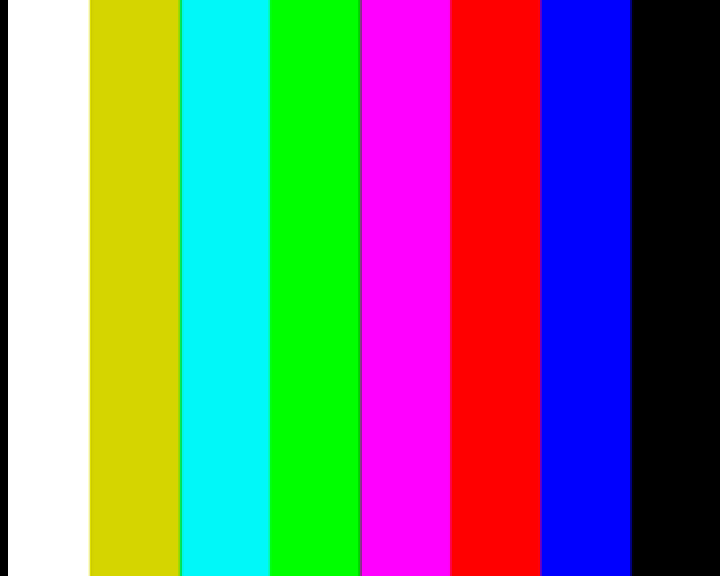{ width="340" } | { width="340" } |

---

### 100% Colour Bars (`100_BARS`)

Same seven-bar layout as `75_BARS` but at full 100% colour saturation. Primary and secondary bars reach the full legal chroma excursion. Useful for checking chroma headroom and clipping behaviour.

| PAL 720×576 | NTSC / PAL-M 720×480 |
|:---:|:---:|
| 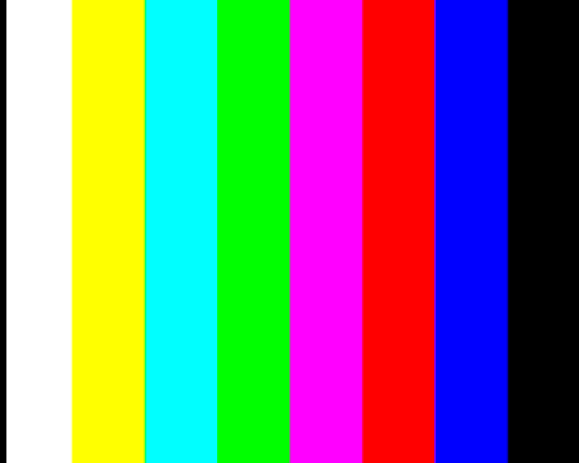{ width="340" } | { width="340" } |

---

### 75% Colour Bars with Red Sub-bars (`75_BARS_RED`)

75% colour bars in the upper portion with a row of red sub-bars occupying the lower section of the frame. Provides an additional red chroma reference alongside the full-bar calibration region.

| PAL 720×576 | NTSC / PAL-M 720×480 |
|:---:|:---:|
| 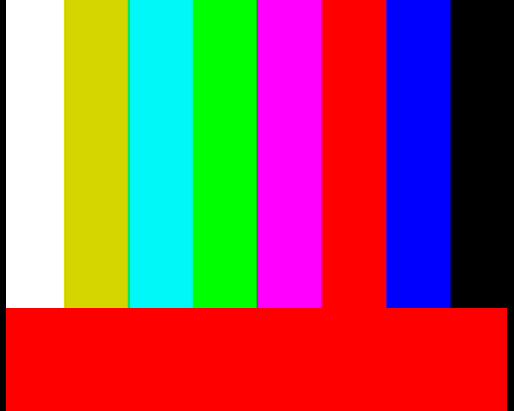{ width="340" } | 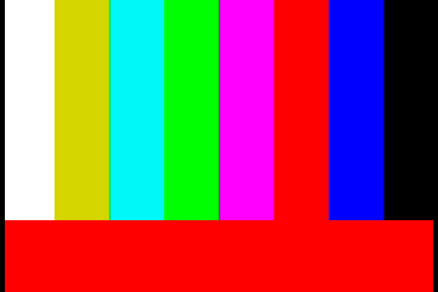{ width="340" } |

---

### SMPTE RP 219 Colour Bars (`SMPTE_BARS` / `SMPTE_BARS_001`)

Full SMPTE colour bar pattern. The upper portion displays 100% bars, the centre shows 75% bars, and the lower section contains sub-bars including a PLUGE region and chroma phase reference patches. The PAL collection names this file `SMPTE_BARS.raw`; the NTSC collection uses `SMPTE_BARS_001.raw`.

| PAL 720×576 (`SMPTE_BARS.raw`) | NTSC / PAL-M 720×480 (`SMPTE_BARS_001.raw`) |
|:---:|:---:|
| 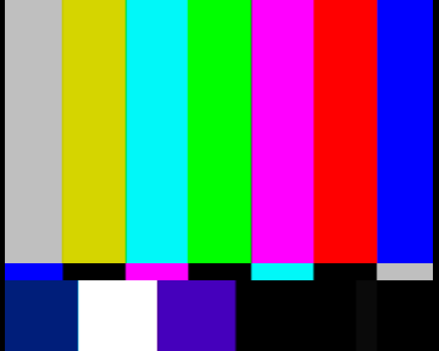{ width="340" } | 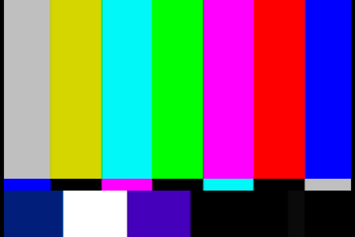{ width="340" } |

---

### Chroma Saturation Ramp (`CHROMA_RAMP`)

A horizontal ramp sweeping from zero chroma (monochrome) on the left to maximum allowed chroma saturation on the right. Used to verify linear chroma encoding across the full saturation range.

| PAL 720×576 | NTSC / PAL-M 720×480 |
|:---:|:---:|
| { width="340" } | 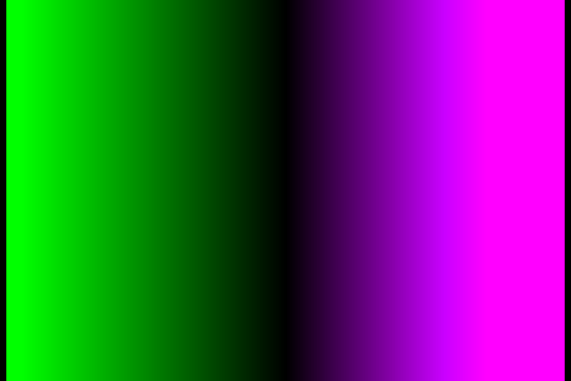{ width="340" } |

---

### Full Range Luma Ramp (`FULL_RAMP`)

A horizontal luma ramp that sweeps from the sub-black region (below code 64) on the left through legal black and peak white up to super-white (above code 940) on the right. Tests the encoder's handling of out-of-range code values at both ends. The raw file faithfully stores these extended-range values; display previews clamp them to the visible range.

| PAL 720×576 | NTSC / PAL-M 720×480 |
|:---:|:---:|
| 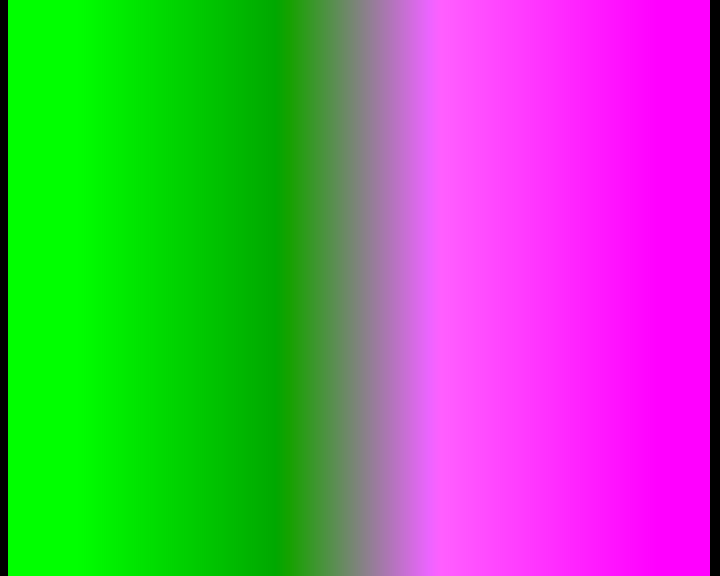{ width="340" } | 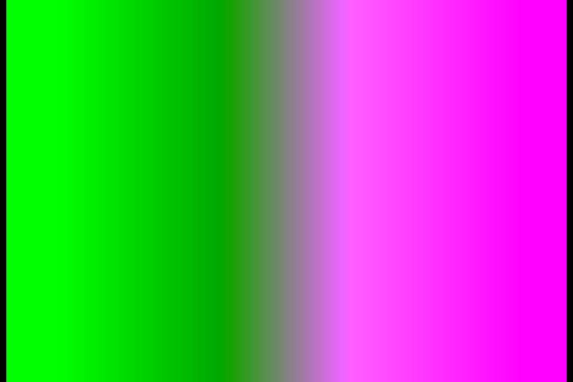{ width="340" } |

---

### Legal Range Luma Ramp (`LEGAL_RAMP`)

A horizontal luma ramp that sweeps exclusively within the legal broadcast range — from code 64 (black) to code 940 (peak white) — without any sub-black or super-white content. Use this in place of `FULL_RAMP` when you specifically want a clean in-range test signal.

| PAL 720×576 | NTSC / PAL-M 720×480 |
|:---:|:---:|
| 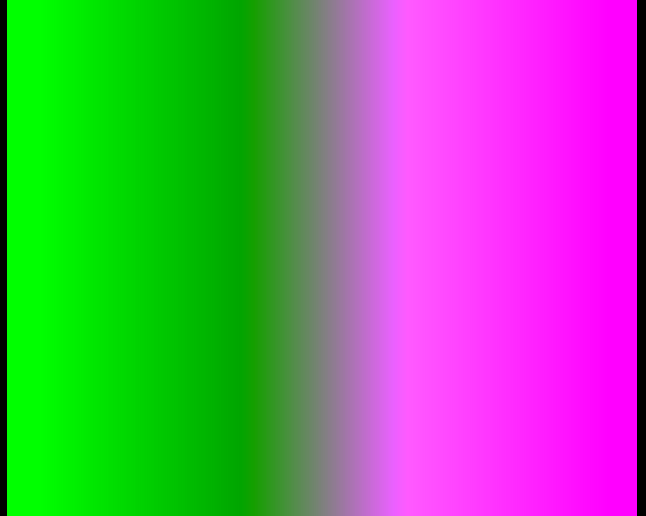{ width="340" } | { width="340" } |

---

### Horizontal Luma Ramp (`LUMA_RAMP`)

A horizontal luma ramp that progresses from black on the left to white on the right. Chroma is held at nominal (no colour). Simple and clean luma linearity reference.

| PAL 720×576 | NTSC / PAL-M 720×480 |
|:---:|:---:|
| { width="340" } | 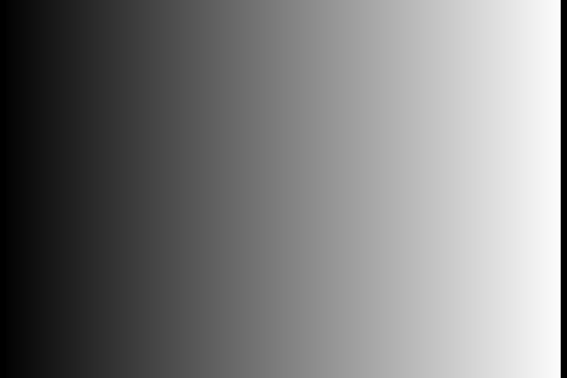{ width="340" } |

---

### Horizontal Luma Ramp (reversed) (`LUMA_RAMP_DOWN`)

The mirror image of `LUMA_RAMP`: white on the left, black on the right. Useful for catching asymmetric encoder nonlinearity.

| PAL 720×576 | NTSC / PAL-M 720×480 |
|:---:|:---:|
| 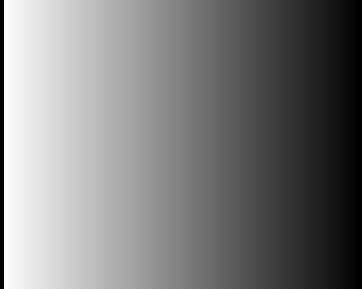{ width="340" } | { width="340" } |

---

### Vertical Luma Ramp (`VERT_LUMA_RAMP`)

A luma ramp that progresses from black at the top of the frame to white at the bottom. Chroma is held at nominal. Complements the horizontal luma ramps by exercising the vertical dimension.

| PAL 720×576 | NTSC / PAL-M 720×480 |
|:---:|:---:|
| 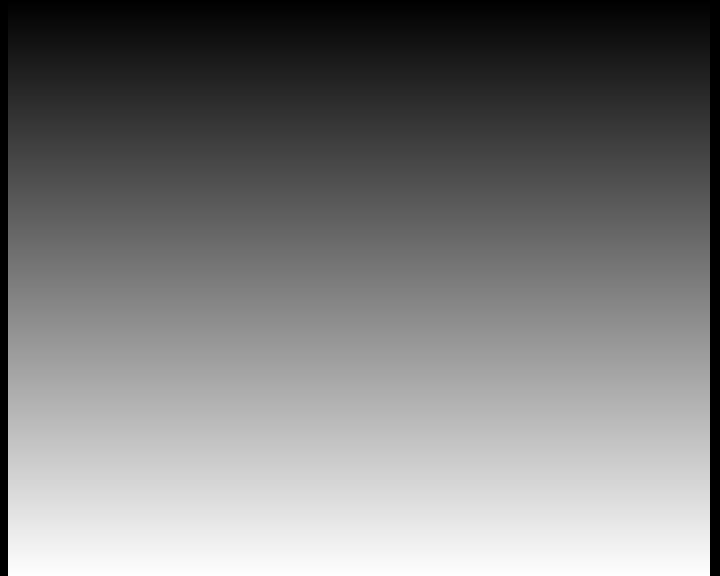{ width="340" } | 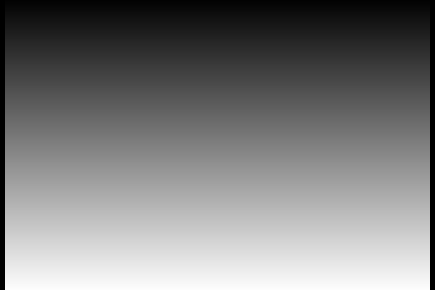{ width="340" } |

---

### 5-Step Horizontal Greyscale Staircase (`GREY_5H_STEP`)

Five equal-width luma steps arranged as vertical bars from black to white. The even step spacing makes it straightforward to verify quantisation linearity in the luma channel.

| PAL 720×576 | NTSC / PAL-M 720×480 |
|:---:|:---:|
| { width="340" } | 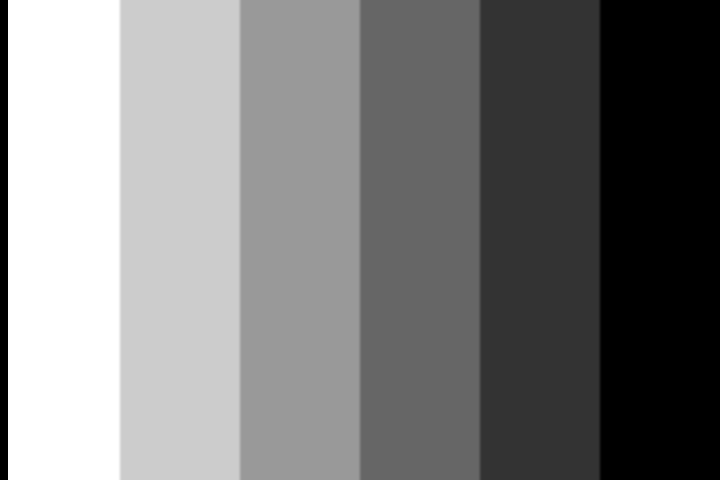{ width="340" } |

---

### 5-Step Vertical Greyscale Staircase (`GREY_5V_STEP`)

Five equal-height luma steps arranged as horizontal bands from black at the top to white at the bottom. The vertical arrangement tests row-to-row luma consistency.

| PAL 720×576 | NTSC / PAL-M 720×480 |
|:---:|:---:|
| { width="340" } | { width="340" } |

---

### 10-Step Horizontal Greyscale Staircase (`GREY_10H_STEP`)

Ten equal-width luma steps as vertical bars across the frame. Greater step density than `GREY_5H_STEP`; provides finer resolution for linearity measurement.

| PAL 720×576 | NTSC / PAL-M 720×480 |
|:---:|:---:|
| 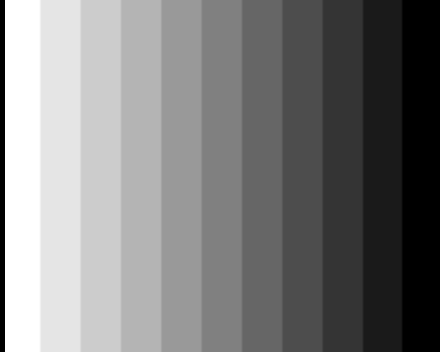{ width="340" } | { width="340" } |

---

### 10-Step Vertical Greyscale Staircase (`GREY_10V_STEP`)

Ten equal-height luma steps as horizontal bands from top to bottom. Counterpart to `GREY_10H_STEP` in the vertical direction.

| PAL 720×576 | NTSC / PAL-M 720×480 |
|:---:|:---:|
| 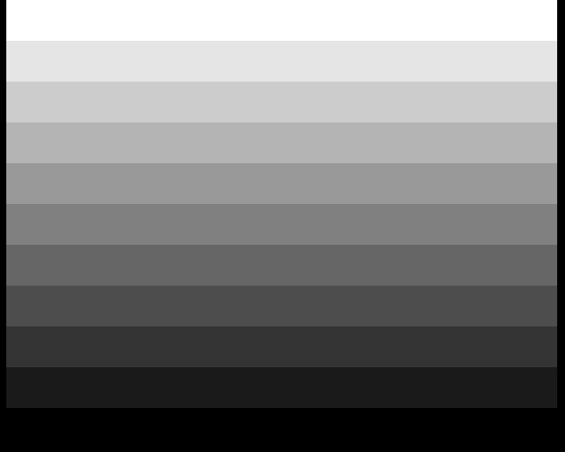{ width="340" } | 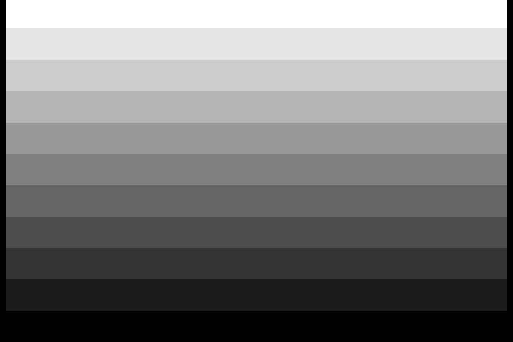{ width="340" } |

---

### Multi-Burst Frequency Sweep (`MULTIBURST`)

Horizontal sine-wave bursts at progressively higher spatial frequencies grouped into vertical zones across the frame. Used to characterise the encoder's horizontal frequency response and to identify bandwidth limiting or ringing artefacts.

| PAL 720×576 | NTSC / PAL-M 720×480 |
|:---:|:---:|
| 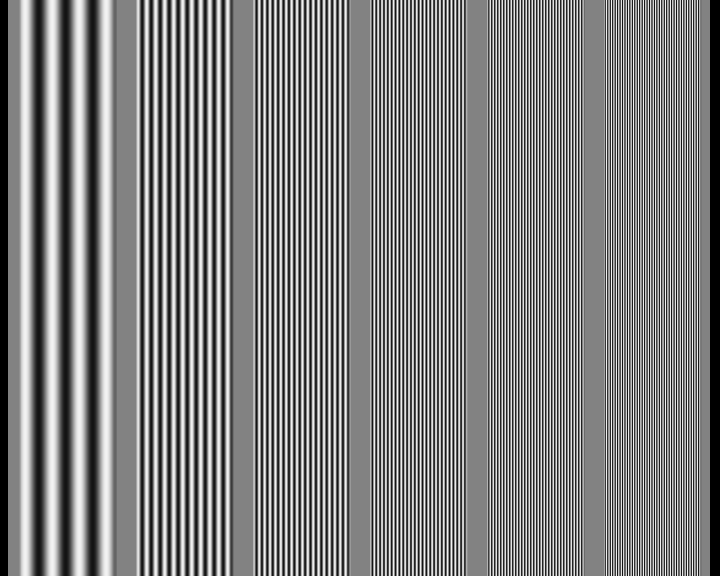{ width="340" } | { width="340" } |

---

### PLUGE (`PLUGE`)

PLUGE (Picture Line-Up Generation Equipment) pattern. Contains a trio of narrow vertical bars at below-black, nominal black, and just-above-black luma levels alongside a mid-grey reference field. The sub-black bar is encoded below code 64; display previews clip it to black.

| PAL 720×576 | NTSC / PAL-M 720×480 |
|:---:|:---:|
| 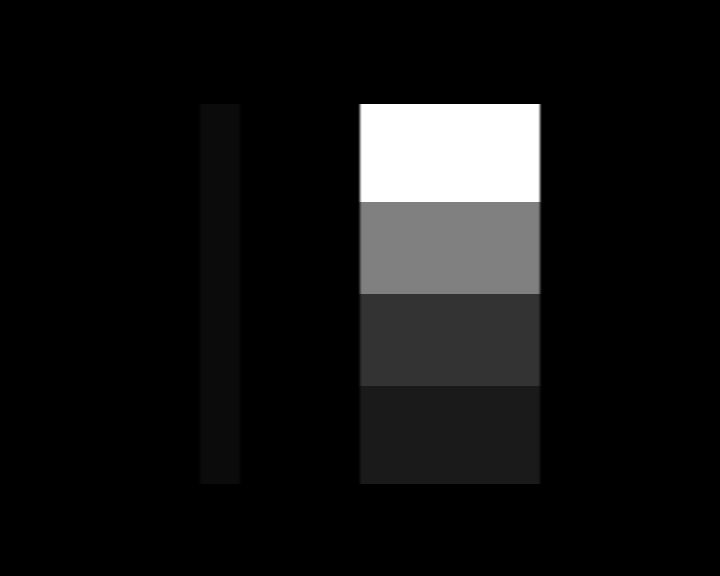{ width="340" } | { width="340" } |

---

### Tartan (`TARTAN`)

A multi-colour diagonal stripe pattern covering a wide gamut of simultaneous Y, Cb, and Cr combinations. Useful for stress-testing the encoder across many simultaneous chroma values in a single frame.

| PAL 720×576 | NTSC / PAL-M 720×480 |
|:---:|:---:|
| 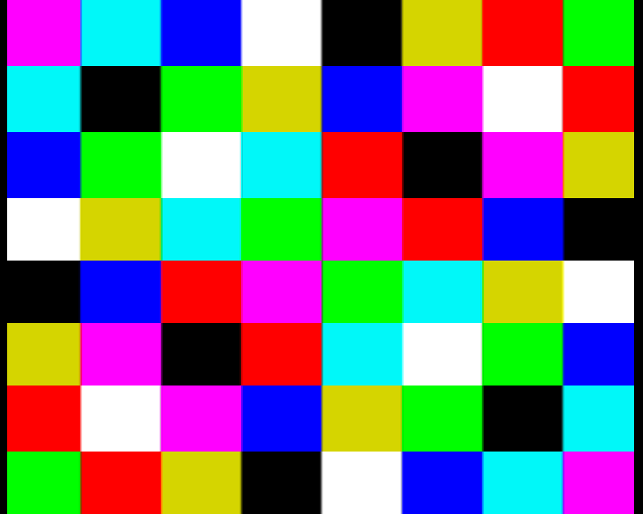{ width="340" } | 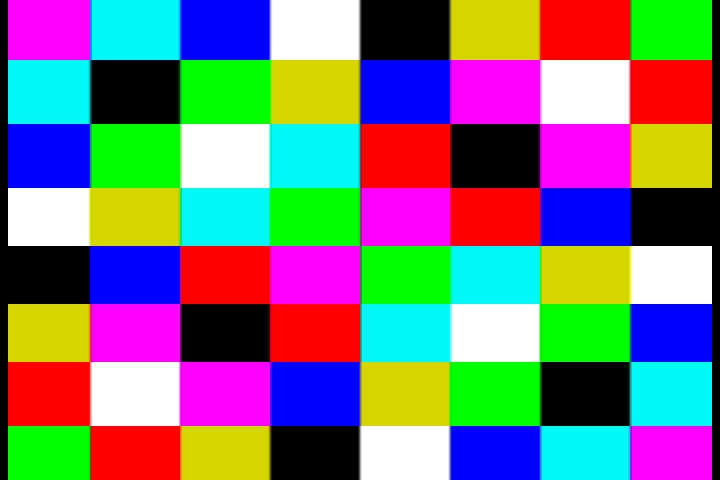{ width="340" } |

---

### Valid-Range Component Ramps (`VALID_RAMPS`)

Three horizontal ramps contained within a single frame, each sweeping one YCbCr component across the studio-legal range while the remaining components are held at nominal values. Confirms that all three components are handled linearly through the full valid code range.

| PAL 720×576 | NTSC / PAL-M 720×480 |
|:---:|:---:|
| 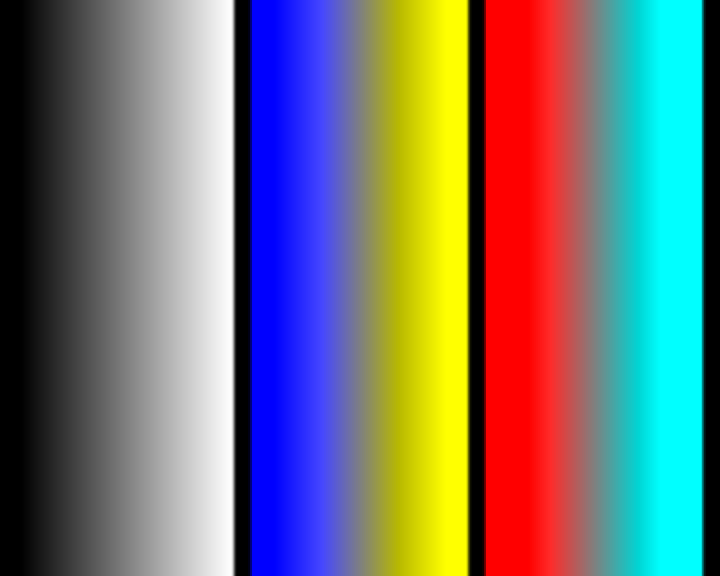{ width="340" } | { width="340" } |

---

### Y, Cb, Cr Component Ramps (`Y_CB_CR_RAMPS`)

Three separate, individually labelled ramps — one for Y (luma), one for Cb, and one for Cr — stacked vertically in the frame. Each ramp sweeps that component across its legal range independently. More explicit than `VALID_RAMPS` when you need to verify individual component behaviour.

| PAL 720×576 | NTSC / PAL-M 720×480 |
|:---:|:---:|
| 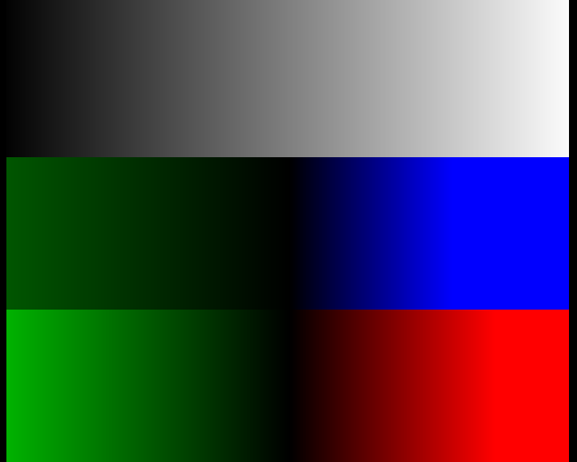{ width="340" } | 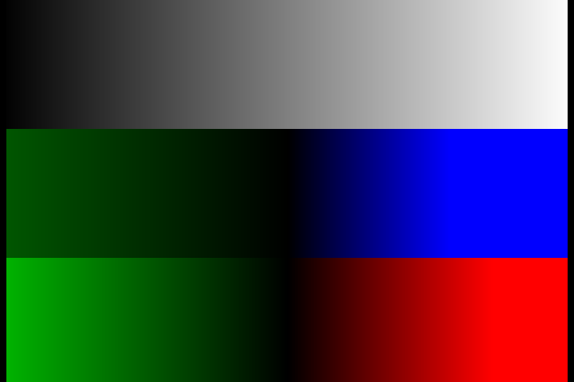{ width="340" } |

---

## Usage Notes

- All files contain the **active picture area only**. encode-orc adds horizontal and vertical blanking, sync pulses, and VBI content for the selected video system and standard.
- These raw files are the preferred deterministic inputs when you need precise sub-black, super-white, or studio-range component behaviour, because they bypass any RGB→YUV conversion step.
- `FULL_RAMP` and `PLUGE` both contain code values outside the legal range. The encoder writes them as-is into the signal; downstream decoders or scopes may clamp or display them differently.
- The PAL-M output formats (`palm-composite`, `palm-yc`) use **NTSC-sized 720 × 480 assets** as their source material.

## YAML Usage

### PAL

```yaml
sections:
  - name: "PLUGE"
    duration: 10
    source:
      type: "yuv422-image"
      file: "${ENCODE_ORC_ASSETS}/720x576/stills/raw/PLUGE.raw"
```

### NTSC

```yaml
sections:
  - name: "PLUGE"
    duration: 10
    source:
      type: "yuv422-image"
      file: "${ENCODE_ORC_ASSETS}/720x480/stills/raw/PLUGE.raw"
```

### PAL-M

PAL-M output uses NTSC-sized (720 × 480) source assets:

```yaml
output:
  format: "palm-composite"

sections:
  - name: "PLUGE"
    duration: 10
    source:
      type: "yuv422-image"
      file: "${ENCODE_ORC_ASSETS}/720x480/stills/raw/PLUGE.raw"
```

## Regenerating Preview Images

The PNG previews in `docs/technical/testcards/images/` were generated from the raw files using the helper script `scripts/raw_yuv422_to_png.py`. To regenerate them after updating the raw assets:

```sh
nix develop
python3 scripts/raw_yuv422_to_png.py
```

The script applies ITU-R BT.601 studio-range YCbCr-to-RGB conversion and writes standard 8-bit RGB PNGs. Sub-black and super-white values are clamped at the display stage only; the source raw data is not modified.
